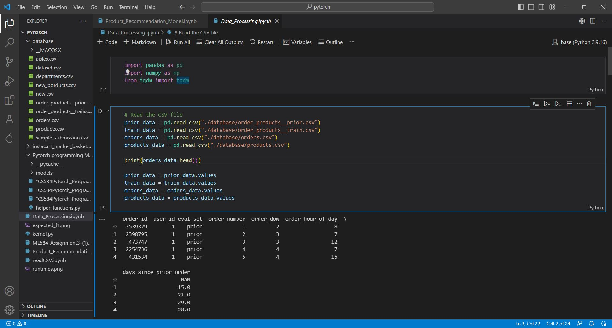
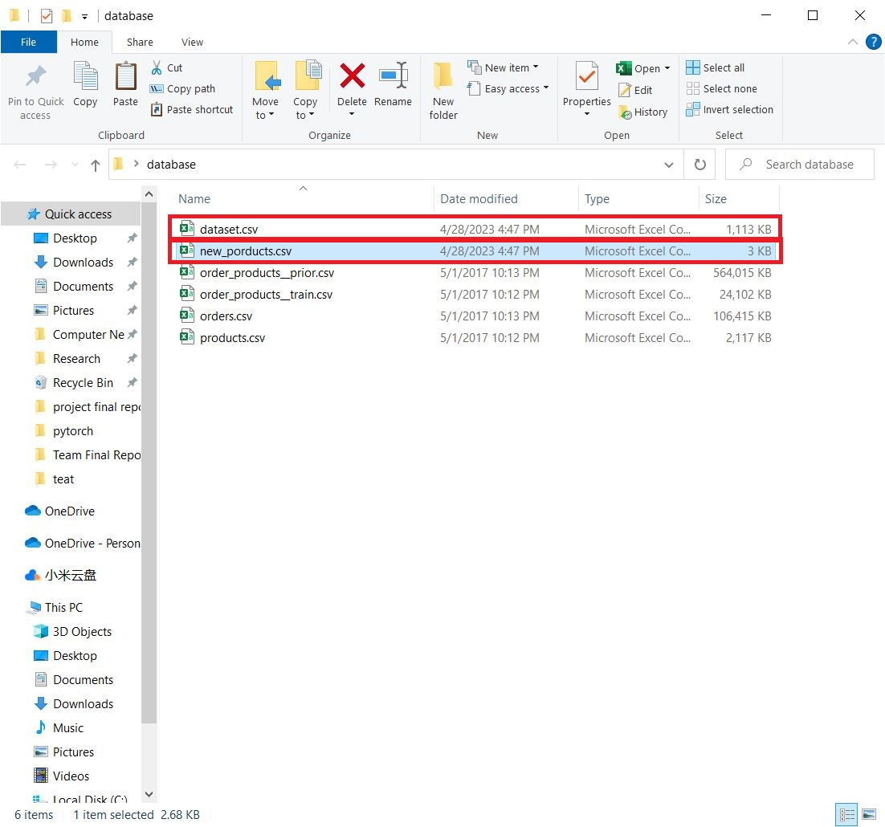
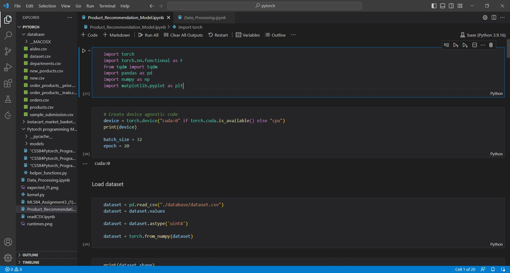
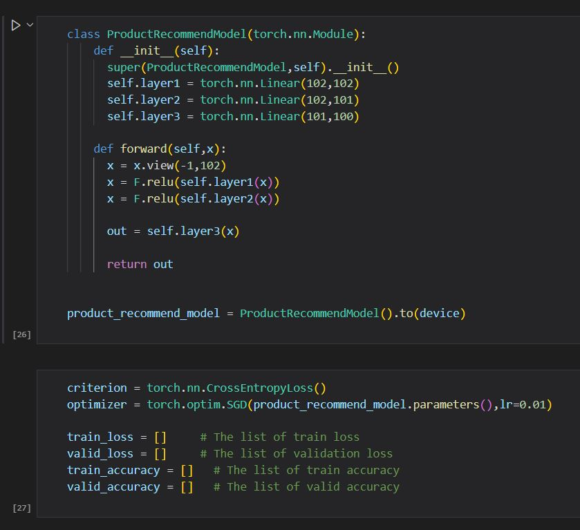
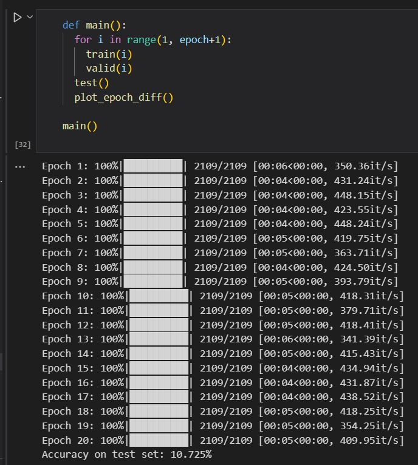
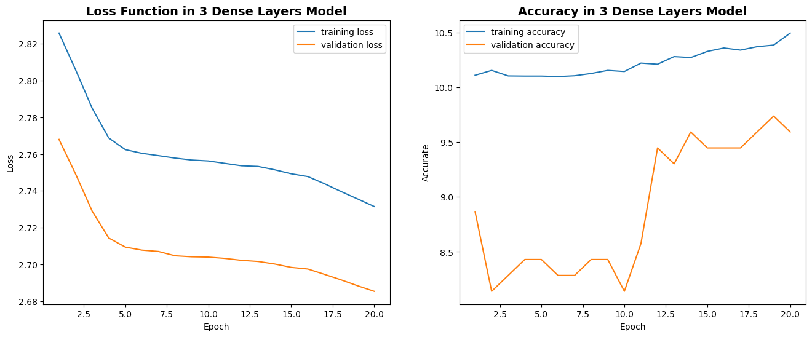

# **CS584_Machine-Learning_Project**

-----

>  Team:
>
>  [@Hongbo Wang](https://github.com/BOBWang1117)
>
>  [@Xiaoting Zhou](https://github.com/May-Xiaoting-Zhou)
>
>  Nevil Jack D
>
>  

## **Environment:**

- Anaconda: 23.3.1

- python: 3.11.0

  

## **Details**

- Type: term project
- Professor: Yan Yan
- Developing Language: Python
- Project Name: Product Recommendation Model
- Time: April/28/2023
- Description: Through a 3 layers of fully connected neural network test as a product recommendation model, the accuracy of the model is tested by splitting into train, validation, and test data set, and among 100 types of products, the accuracy of predicting the next purchased product reaches 10.725%.

## **Dependencies:** 

- Kaggle data set: https://www.kaggle.com/competitions/instacart-market-basket-analysis/data

## **Install package:**

- torch: 1.13.1
- tdmq: 4.65.0
- pandas: 1.5.3
- numpy: 1.23.5
- matplotlib: 3.7.1

## **Run program:**

Method:

- Download Anaconda and necessary environment
- Download the [datasets](https://www.kaggle.com/competitions/instacart-market-basket-analysis/data)
- Run Data_Processing.ipynb file (First)
- Run Product_Recommendation_Model.ipynb file (Second)

(First): need data professing first

## **Example:**

1. The screenshot of Data_Processing.ipynb file.

   

   

2. The screenshot of the two newly generated CSV files.

   

   

3. The screenshot of Product_Recommendation_Model.ipynb file.

   

   

4. The screenshot of model.

   

   

5. The screenshot of accuracy on test set.

   

   

6. The screenshot of model train and validation loss, and train and validation accuracy.

   

   

   

